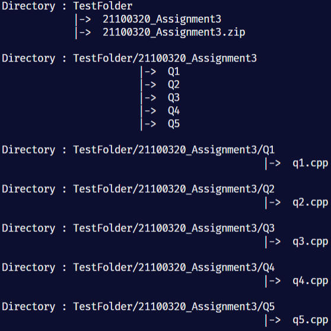
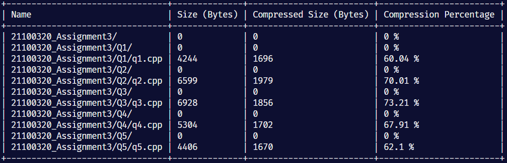

# File-Organization

## Print out a file directory &amp; show detailed content of a zip file

---

### Usage

This program contains two functions: print_dir and read_zip.

**print_dir:** prints the contents inside the specified directory.

Requires two arguments: _(current directory path, folder name)_. Current directory path can be obtained using Path.cwd() using the pathlib library. The folder name is any folder inside the current directory path.

**read_zip:** reads the content inside a zip file and produces a summary of that.

Requires one argument: _(file_path)_. This is the path to the zip file being examined.

---

### Used Modules

1. [os](https://docs.python.org/3/library/os.html)
2. [Path from pathlib](https://docs.python.org/3/library/pathlib.html)
3. [zipfile](https://docs.python.org/3/library/zipfile.html)
4. [print_table from pTable](https://github.com/AhmedFarhan252/Python-Tables)

---

### Example

**Note:**

1. `cd` is obtained using `Path.cwd()` to get the directory of the current folder.
2. `TestFolder` is a folder inside the cd directory which contains the zip file as well as multiple other folders.
3. `cd / 'TestFolder' / '21100320_Assignment3.zip'` will create a path by combining all three arguments as this is a built-in feature in the pathlib module and cd is a Path class.

#### print_dir example

**Input:** `(cd,"TestFolder")`

**Output:**

#### read_zip example

**Input:** `(cd / 'TestFolder' / '21100320_Assignment3.zip')`

**Output:**

